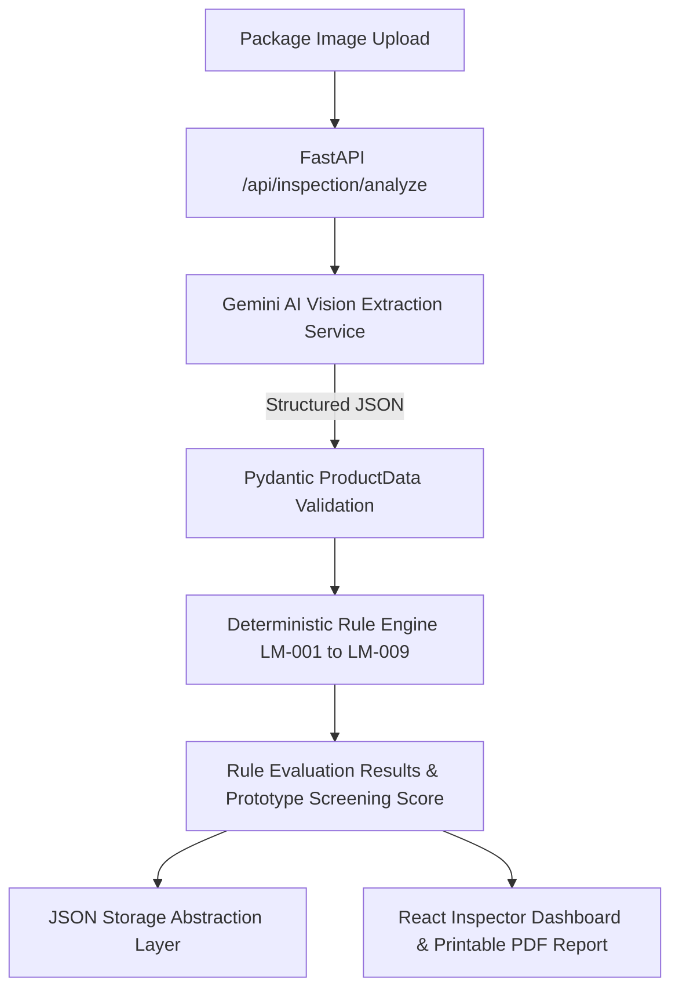

# Smart Legal Metrology Package Compliance System (SIH26034 Prototype V1)

> **SIH26034 Prototype V1**: Functional prototype for Smart India Hackathon problem statement **SIH26034**.  
> Screen packaged commodity labels for Legal Metrology compliance using AI label extraction + deterministic rule engine evaluation.

---

## 🏛️ Core Architectural Principle

```
Package Image ──> AI Extraction (Gemini) ──> Structured ProductData ──> Deterministic Rule Engine ──> COMPLIANT / NON-COMPLIANT / NEEDS REVIEW
```

> **IMPORTANT**: AI EXTRACTS AND INTERPRETS. DETERMINISTIC RULES MAKE COMPLIANCE DECISIONS.
> The AI Vision model extracts structured label declarations into a Pydantic schema (`ProductData`). A separate Python rule engine deterministically evaluates Legal Metrology rules (LM-001 to LM-009) to compute PASS/FAIL/REVIEW/NA statuses. The AI **never** directly decides legal status.

---

## 📐 Architecture Diagram



---

## 📜 Legal Metrology Compliance Rules Engine (LM-001 — LM-009)

| Rule ID | Rule Name | Evaluated Fields | Logic / Safeguard Behavior |
|---|---|---|---|
| **LM-001** | Manufacturer / Packer / Importer Details | `manufacturer.name`, `address` | PASS if name & address verified; FAIL if address missing; REVIEW if incomplete. |
| **LM-002** | Country of Origin | `country_of_origin`, `is_imported` | PASS if imported & country declared; FAIL if imported & country missing; NA for domestic products; REVIEW if import status uncertain. |
| **LM-003** | Generic Product Name | `generic_name`, `brand_name` | PASS if generic commodity name declared; REVIEW if brand found without explicit generic name; FAIL if unstated. |
| **LM-004** | Net Quantity | `quantity.value`, `unit` | PASS if net quantity & standard unit (g, kg, ml, L, N) present; REVIEW if unit ambiguous; FAIL if missing. |
| **LM-005** | Manufacture / Packing Date | `dates.manufacture_date`, `packing_date` | PASS if month & year declared; FAIL if missing. |
| **LM-006** | Best Before / Use By | `dates.best_before`, `category` | Evaluates category applicability. PASS if declared; NA for non-perishables (electronics/hardware); FAIL if missing for perishables (Food/Cosmetics). |
| **LM-007** | Maximum Retail Price (MRP) | `mrp.value`, `raw_text` | PASS if MRP value present; REVIEW if price detected without MRP text; FAIL if unstated. |
| **LM-008** | MRP Tax-Inclusive Indication | `mrp.inclusive_of_taxes`, `raw_text` | Fuzzy regex matching for tax-inclusive phrasing ("Inclusive of all taxes", "incl. of all taxes"). REVIEW if image unclear. |
| **LM-009** | Consumer Care Details | `consumer_care.phone`, `email`, `address` | PASS if at least one contact detail present; FAIL if absent. |

---

## 🛠️ Technology Stack

- **Frontend**: React + Vite + Tailwind CSS + Lucide Icons
- **Backend**: Python 3.14 + FastAPI + Pydantic v2 + Pillow
- **AI Vision Engine**: Google GenAI Python SDK (`google-genai`) with Gemini 2.5 Flash Vision API
- **Storage Abstraction**: In-memory & local JSON abstraction (`inspections.json`)

---

## 🚀 Setup & Running Instructions

### 1. Environment Variables Setup

Create a `.env` file inside `backend/`:

```bash
# backend/.env
GEMINI_API_KEY=your_google_gemini_api_key_here
PORT=8000
HOST=0.0.0.0
```

> **Note**: Demo Mode works out-of-the-box even without a `GEMINI_API_KEY` configured!

### 2. Backend Execution (FastAPI)

```bash
cd backend
python -m pip install -r requirements.txt
python -m uvicorn app.main:app --reload --port 8000
```
- Health Check: `http://localhost:8000/api/inspection/health`
- Interactive API Docs: `http://localhost:8000/docs`

### 3. Frontend Execution (React + Vite)

```bash
cd frontend
npm install
npm run dev
```
- Open Inspector Portal: `http://localhost:5173`

---

## ⚡ Demo Mode (No API Key Required)

The system includes pre-loaded sample packages for immediate presentation and testing:

1. **Sample 1: Compliant Package (Biscuits)** → Produces `COMPLIANT` status with 100% Prototype Screening Score.
2. **Sample 2: Non-Compliant Package (Spicy Snacks)** → Produces `NON-COMPLIANT` status with rule FAIL details.

All demo samples route through the **SAME deterministic Rule Engine**:
`Demo ProductData` → `Rule Engine` → `Rule Results`.

---

## ⚖️ Mandatory Legal Disclaimer

"Prototype screening result. Final regulatory determination should be verified by an authorized Legal Metrology officer and applicable current regulations."
