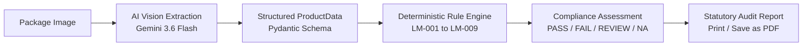

# Smart Legal Metrology Package Compliance System (SIH26034)

> **Smart India Hackathon Problem Statement SIH26034**  
> Functional Prototype V1: Automated packaged commodity label declaration extraction & deterministic compliance screening.

---

## 1. Executive Summary & Problem Context

Packaged commodities sold across India must adhere to strict statutory disclosure standards under the **Legal Metrology Act, 2009** and the **Legal Metrology (Packaged Commodities) Rules, 2011**. 

Enforcement officers routinely inspect physical retail packaging for mandatory declarations including manufacturer identification, common/generic name, net quantity in SI units, maximum retail price (MRP with tax clause), manufacturing/packing dates, best-before validity, and consumer grievance redressal channels.

This system provides an automated inspection assistant:
1. An enforcement officer uploads or photographs a package label.
2. Multimodal AI (Gemini Vision) extracts visible label text and declarations into structured data.
3. A **deterministic Legal Metrology rule engine** evaluates compliance against statutory rules (LM-001 through LM-009).
4. The system renders an official compliance assessment with **PASS**, **FAIL**, **REVIEW**, and **N/A** statuses, audit evidence, Prototype Screening Score, and printable statutory reports.

---

## 2. Core Architectural Principle



> **CRITICAL ARCHITECTURAL BOUNDARY:**
> - **AI EXTRACTS AND INTERPRETS**: The LLM reads visible text, identifies entity names, prices, dates, and units, and outputs structured JSON.
> - **DETERMINISTIC RULES DECIDE COMPLIANCE**: The AI NEVER decides whether a package is "legal" or "compliant". Final compliance status and scores are computed purely by deterministic algorithmic logic.

---

## 3. Technology Stack

### Frontend
- **Framework**: React 18 + Vite
- **Styling**: Tailwind CSS (Government inspection portal theme: Navy Blue `#0F2942`, Amber `#D97706` accents, Slate grays)
- **Icons**: Lucide React
- **Storage**: Client-side LocalStorage abstraction with server sync

### Backend
- **Framework**: Python 3.14 + FastAPI + Uvicorn
- **Data Validation**: Pydantic v2
- **Image Processing**: Pillow (PIL)
- **AI SDK**: Google GenAI Python SDK (`google-genai`)
- **Storage Layer**: Local JSON / Memory store (Designed for seamless drop-in replacement with PostgreSQL / Firebase)

---

## 4. Project Monorepo Structure

```
SIH26034/
├── frontend/
│   ├── src/
│   │   ├── components/
│   │   │   ├── CheckCard.jsx           # Individual compliance check card
│   │   │   ├── CheckDetailModal.jsx    # Verbatim evidence & rationale modal
│   │   │   ├── ExtractedInfoTable.jsx  # Structured declaration table
│   │   │   ├── Header.jsx              # Navigation header with actions
│   │   │   ├── ImagePreviewCard.jsx    # Image preview & quality stats
│   │   │   ├── ScoreMeter.jsx          # Circular Prototype Screening Score gauge
│   │   │   ├── Sidebar.jsx             # Official government portal sidebar
│   │   │   └── StatusBadge.jsx         # High-contrast PASS/FAIL/REVIEW/NA badges
│   │   ├── pages/
│   │   │   ├── Login.jsx               # Officer login + 1-click Demo Login
│   │   │   ├── Dashboard.jsx           # Metrics, recent inspections, demo cards
│   │   │   ├── NewInspection.jsx       # Upload dropzone, preview, category selector
│   │   │   ├── AnalysisProgress.jsx    # 6-stage real-time processing pipeline
│   │   │   ├── Results.jsx             # Compliance assessment & check matrix
│   │   │   ├── History.jsx             # Chronological audit log & filter
│   │   │   ├── Report.jsx              # Printable statutory compliance report
│   │   │   └── Settings.jsx            # Rule catalog (LM-001 to LM-009)
│   │   ├── services/
│   │   │   ├── api.js                  # FastAPI backend client
│   │   │   └── storage.js              # Local storage cache service
│   │   ├── data/
│   │   │   └── demoSamples.js          # Pre-configured compliant & non-compliant packs
│   │   ├── App.jsx                     # Top-level application coordinator
│   │   ├── main.jsx                    # React entrypoint
│   │   └── index.css                   # Tailwind styles & print stylesheets
│   ├── package.json
│   ├── tailwind.config.js
│   └── vite.config.js
│
├── backend/
│   ├── app/
│   │   ├── api/
│   │   │   └── inspection.py           # REST endpoints for analysis & history
│   │   ├── rules/
│   │   │   ├── common_rules.py         # Statutory rules LM-001 to LM-009
│   │   │   └── rule_engine.py          # Deterministic evaluation & scoring
│   │   ├── services/
│   │   │   ├── ai_service.py           # Gemini Vision structured extraction
│   │   │   ├── compliance_service.py   # Inspection orchestrator & demo datasets
│   │   │   └── storage_service.py      # Persistence abstraction
│   │   ├── utils/
│   │   │   └── image_utils.py          # Pillow format & quality validation
│   │   ├── schemas.py                  # Pydantic data schemas
│   │   └── main.py                     # FastAPI application & CORS
│   ├── test_rules.py                   # Automated rule engine test suite
│   ├── requirements.txt
│   └── .env.example
│
├── README.md
└── .gitignore
```

---

## 5. Statutory Compliance Rules (LM-001 to LM-009)

| Rule ID | Rule Name | Requirement | Determination Logic |
| :--- | :--- | :--- | :--- |
| **LM-001** | Manufacturer / Packer Details | Name and complete address | **PASS**: Name + Address verified.<br>**REVIEW**: Partial/ambiguous address.<br>**FAIL**: Information missing. |
| **LM-002** | Country of Origin | Import origin declaration | **PASS**: Imported + origin declared OR domestic origin.<br>**FAIL**: Imported + origin missing.<br>**NA**: Clearly domestic manufacturing.<br>**REVIEW**: Import status uncertain. |
| **LM-003** | Generic Commodity Name | Common identity of commodity | **PASS**: Generic name verified distinct from brand.<br>**REVIEW**: Generic name identical to brand.<br>**FAIL**: Missing. |
| **LM-004** | Net Quantity in SI Units | Weight/volume/measure | **PASS**: Numeric value + standard SI unit (g, kg, ml, L, N).<br>**REVIEW**: Ambiguous unit.<br>**FAIL**: Missing. |
| **LM-005** | Manufacture / Packing Date | Month & year of mfg/packing | **PASS**: Mfg or packing date/period detected.<br>**FAIL**: Missing. |
| **LM-006** | Best Before / Use By Date | Expiry / validity period | **PASS**: Expiry date/duration declared.<br>**FAIL**: Missing for perishable/food categories.<br>**NA**: Non-perishable goods (hardware, electronics).<br>**REVIEW**: Category applicability uncertain. |
| **LM-007** | Maximum Retail Price (MRP) | Retail price in INR (₹) | **PASS**: MRP amount detected.<br>**REVIEW**: Ambiguous price string.<br>**FAIL**: Missing. |
| **LM-008** | MRP Tax-Inclusive Indication | Tax inclusivity wording | **PASS**: Evidence of 'Inclusive of all taxes' or equivalent wording detected.<br>**REVIEW**: MRP present but tax clause unverified.<br>**NA**: MRP absent. |
| **LM-009** | Consumer Care Helpline | Grievance redressal contact | **PASS**: At least one consumer phone, email, or address detected.<br>**FAIL**: Grievance redressal details missing. |

---

## 6. Scoring & Determination Logic

1. **Overall Determination**:
   - **`NON_COMPLIANT`**: If **any** applicable rule results in `FAIL`.
   - **`NEEDS_REVIEW`**: If **any** applicable rule results in `REVIEW` and there are **no** `FAIL` rules.
   - **`COMPLIANT`**: If **all** applicable rules result in `PASS`.

2. **Prototype Screening Score**:
   - Only applicable rules are included in the denominator (`PASS` + `FAIL` + `REVIEW`).
   - `PASS` = 1.0 point, `REVIEW` = 0.5 points, `FAIL` = 0.0 points.
   - `NA` rules do **not** penalize or alter the score.

---

## 7. Setup & Execution Instructions

### Prerequisites
- Python 3.10+ (Tested on Python 3.14)
- Node.js 18+ (Tested on Node v24)
- npm 9+

### Backend Setup
```bash
cd backend

# 1. Install Python dependencies
pip install -r requirements.txt

# 2. Configure environment variables (optional for demo mode)
copy .env.example .env

# 3. Run automated rule engine verification
python test_rules.py

# 4. Start FastAPI server
python -m uvicorn app.main:app --reload --port 8000
```
API Documentation will be available at: `http://localhost:8000/docs`

### Frontend Setup
```bash
cd frontend

# 1. Install dependencies
npm install

# 2. Start Vite development server
npm run dev
```
Open browser at: `http://localhost:5173/`

---

## 8. Demo Mode (Zero API Key Setup Required)

The prototype is equipped with **instant demo evaluation** that functions 100% reliably even without internet access or a `GEMINI_API_KEY`:

1. Click **"Demo Login"** on the login screen.
2. Select either of the pre-configured test scenarios:
   - **Sample 1 (Compliant Biscuit Pack)**: Fully declared package &rarr; yields **COMPLIANT** (`100%` score).
   - **Sample 2 (Non-Compliant Snack Pack)**: Defective package missing address, mfg date, and consumer care &rarr; yields **NON-COMPLIANT** (`39%` score).
3. Both samples pass through the **exact same deterministic compliance rule engine** as live vision images.

---

## 9. Legal Disclaimer

> **Statutory Disclaimer**: Prototype screening result. Final regulatory determination should be verified by an authorized Legal Metrology officer and applicable current regulations.
